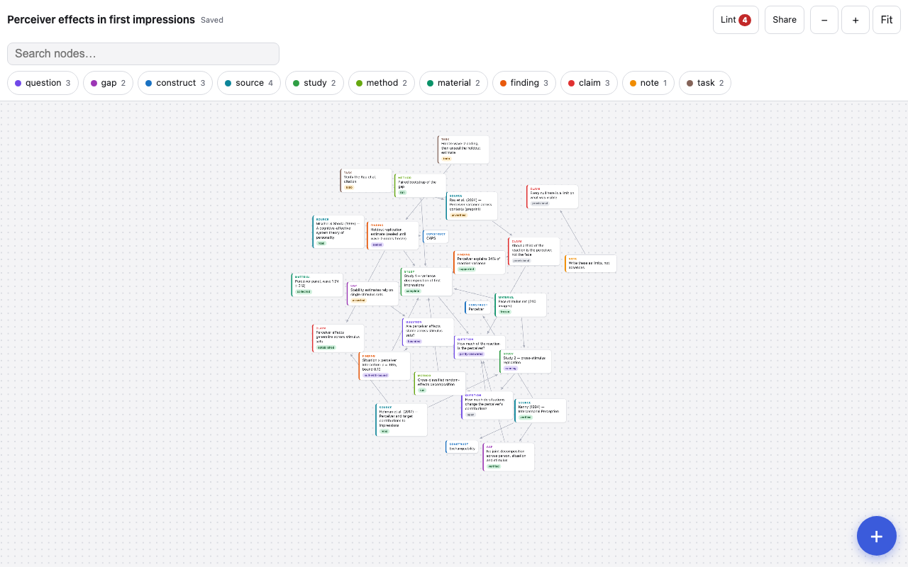

# Research graph

**Live demo:** <https://alpkaraagac.github.io/ResearchGraphApp/> · **Tests:** [tests.html](https://alpkaraagac.github.io/ResearchGraphApp/tests.html) · **Schema:** [SCHEMA.md](SCHEMA.md)



A single-page app for mapping **one research project** as a typed graph: questions,
gaps, studies, methods, materials, findings, claims, sources. It is deliberately not
a general mind-map tool — it knows the difference between a finding and a claim,
between a null result and an untestable one, and between a question you answered and
one you bounded. Those distinctions are what make the graph *lintable*: the app tells
you which claims have no findings under them, which questions nothing addresses, and
which citations you are leaning on but haven't verified. The demo opens with a real
example project ([examples/demo.json](examples/demo.json)) that deliberately ships
with four lint findings, so the badge has something to say.

Plain HTML, CSS and ES modules. No build step, no framework, no dependencies, no
backend, no accounts, no analytics. The graph is one JSON object; everything else is
rendering. Work is autosaved to `localStorage` per graph — the toolbar always shows
whether it is stored.

## What it does

- **Render** — force-directed layout over a pannable, zoomable canvas; nodes as
  cards styled per type with a status flag; tap a node to dim everything not
  adjacent and open a detail panel whose relations are links you can follow.
  Mobile-first: the panel is a bottom sheet, the add-node flow a full-screen form.
- **Edit** — add, edit and delete nodes and edges. Forms offer only the statuses
  valid for the chosen type and only the relations the schema allows between the
  two types being connected; deleting a node warns about the edges it takes with
  it. A raw-JSON tab (with validation) covers bulk edits.
- **Lint** — the eight rules from [SCHEMA.md §4](SCHEMA.md), live-counted in the
  toolbar; each finding jumps to the offending node.
- **Share** — export the graph as JSON, as [JSON Canvas](https://jsoncanvas.org)
  (`.canvas`, readable in Obsidian; round-trips losslessly), or as a
  **self-contained HTML file** with the whole viewer inlined — mail it to a
  colleague and they see exactly what you see, from a double-click, with nothing
  installed. Import accepts JSON and `.canvas`.
- **Sources** — paste or drop a CSL-JSON or BibTeX export and each item becomes a
  `source` node; re-importing updates rather than duplicates (matched on Zotero
  key, then DOI, then citation key). Optional one-way pull from the
  [Zotero Web API](https://www.zotero.org/support/dev/web_api/v3/start), behind an
  API key that never leaves your browser.

## Schema summary

Eleven node types in four families, each with its own status vocabulary
(see [SCHEMA.md](SCHEMA.md) for the full definitions):

| Family | Types |
|---|---|
| Asking | `question` (open / answered / partly-answered / bounded / abandoned) · `gap` (asserted / verified / contested / closed-by-others) |
| Grounding | `construct` · `source` (to-read / read / verified / unverified) |
| Doing | `study` (planned / running / complete / abandoned) · `method` (draft / preregistered / run / superseded) · `material` (planned / collected / frozen) |
| Concluding | `finding` (supported / null-with-bound / untestable / sealed / withdrawn / invalid) · `claim` (established / provisional / contested / abandoned) · `note` · `task` (todo / doing / done) |

Fourteen relations form a closed set with fixed from → to types — `asks`,
`motivates`, `addresses`, `uses`, `yields`, `supports`, `contradicts`, `bounds`,
`qualifies`, `answers`, `grounds`, `threatens`, `inspires`, `blocks` — and eight
lint rules check the graph: unsupported claim, orphan finding, unaddressed
question, unwarranted question, bare study, unverified citation, unhandled threat,
and status mismatch (a question marked answered whose only supporting findings are
untestable, sealed or withdrawn).

## Running it

It is a static site — any static server works:

```bash
python3 -m http.server 4173
```

then open <http://localhost:4173>. (Opening `index.html` straight from `file://`
is blocked by Chrome and Firefox, which refuse module imports from file pages —
the self-contained HTML *export* is the artifact that opens anywhere, including
`file://`.) The tests are a plain page with no runner: open
[tests.html](https://alpkaraagac.github.io/ResearchGraphApp/tests.html) and read
the green.

## Layout of the repo

```
index.html        app shell
css/app.css       all styles (mobile-first)
js/schema.js      types, statuses, relations, validation — mirrors SCHEMA.md
js/lint.js        the eight lint rules
js/layout.js      deterministic force-directed layout
js/render.js      cards, edges, panels
js/view.js        pan / zoom / fit
js/forms.js       schema-driven edit dialogs
js/exporter.js    JSON, JSON Canvas, self-contained HTML
js/sources.js     CSL-JSON + BibTeX import, Zotero Web API
js/store.js       localStorage persistence
tests.html        74 assertion tests, no runner
examples/         the demo graph
```
